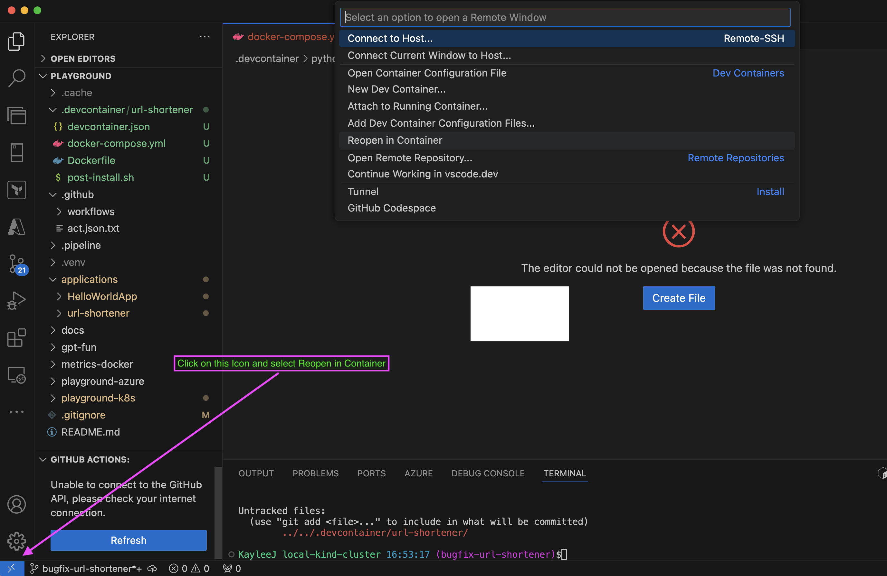
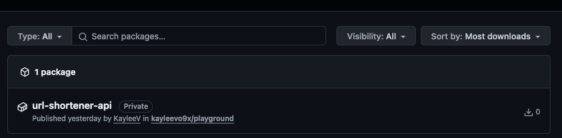

# Shorten URL API

A simple web API to generate a short URL from a full URL and store it in a Postgressql database for demonstration purposes

## Requirements
If you are using Vscode, it's highly encouraged to use the provided [url-shortener devcontainer](../../.devcontainer/url-shortener/devcontainer.json). 
This option creates a local development docker container with all the following tools and applications requirements in place and enable the developers to start coding immediately  



```
- python 3.12+
- docker 
- poetry 1.8.3+
```

## Local Developments Using devcontainer
- Rename `.env.dev` to `.env` to load required environment variables start the `devcontainer` and that's it! You should now be ready for coding in a local development docker container with all the tools and requirements in place. Magic!
- If there's a requirement change, update `pyproject.toml` > Open Vscode Remote Windows > Rebuild Container
***Notes:*** Rebuild Dev Container will also tear down the postgresql volume which wipes out any existing data in the database

### Serve the application:
Start the API

    uvicorn url_shortener.main:app --host 0.0.0.0 --port 8000 --reload --log-level debug

## Local Developments Traditional Way
- Ensure poetry is installed pip install poetry
- Rename `.env.dev` to `.env` to load required environment variables
 
### Create Virtual Environment:
Run the following command from the root `url-shortener`:

    python -m venv .venv

Activate the virtual enviornment for development purpose:

    source .venv/bin/activate

### Install Preprequisites:
Run the following:

    poetry install
    poetry build

### Serve the application:
Run the following command to stand up postgresql locally

    docker-compose up
    
Start the API

    uvicorn url_shortener.main:app --host 0.0.0.0 --port 8000 --reload --log-level debug

The API url: http://localhost:8000
The API docs url: http://localhost:8000/docs 
Any development changes to files in the `url-shortener` module will cause the application to reload automatically. This command will seize control of the terminal until it is closed.

## Local Development using Docker
The advantage of serving the api locally, as described in the above section, is that codebase changes automatically take effect without the need to rebuild the API image. 
However, the entire application stack, comprising PostgreSQL, and the API, can also be deployed with a single Docker Compose command by uncommenting the `api` service section in the `docker-compose.yml` file. 
To apply any changes in the codebase, execute the following command:

    docker-compose up --build

The api will then be accessible at the same url http://localhost:8000
This option facilitates a quick local testing without having to run multiple different commands. 

## Cleanup

During the development phase, various data may be added to the database and stored in the specified Docker volumes. To reset this data, run the following command to remove the containers and also destroy the volumes.

    docker-compose down --volume

For Vscode `devcontainer`, run the same command from [url-shortener devcontainer](../../.devcontainer/url-shortener/devcontainer.json)

## Docker Image
Set `GITHUB_TOKEN` environment varible in the console to access the target GCR
    export GITHUB_TOKEN=<PAT>

Run the following script to build and push the image as needed
    `./docker-build-push.sh` -t <tag> -r <registry repo name> -u <registry username>`

On success, a package should be available in the target GRC


## CI/CD
Once development work is done, run `poetry version <new version>` to upgrade the app version in `pyproject.toml`. CICD will use this version to update the API deployment helmchart
Create a PR for the change
[api-ci-on-pr.yml](../../.github/workflows/api-ci-on-pr.yml) is triggered on PR creation to run `lint` and `test`
[api-ci-on-push.yml](../../.github/workflows/api-ci-on-push.yml) is triggered on PR merged to build and push the Docker image to Github container registry of the repo