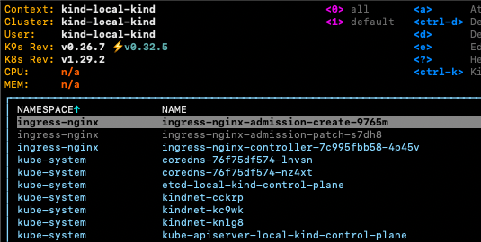

# Local Kind Cluster

#### Prerequisites

* [Docker](https://docs.docker.com/engine/install/)
* [kubectl](https://kubernetes.io/docs/tasks/tools/)
* [Helm](https://helm.sh/docs/intro/install/)
* [Terraform](https://developer.hashicorp.com/terraform/install)

---

### KinD Kubernetes Cluster


This project will launch a local Kubernetes Cluster with 2 nodes using [KinD](https://kind.sigs.k8s.io/).

The following features will also pre-installed as part of this project

* Nginx Ingress Controller for KinD
* Prometheus, alertmanager, Grafana metrics stack

#### Starting Cluster

Ensure you have Docker running.  

##### Windows
```start-cluster.bat```

##### MacOS
```./start-cluster.sh```


#### Startup Steps

##### Step 1

Run start-cluster.bat or start-cluster.sh, KinD shoudl be downloaded and started.

```
#> ./start-cluster.sh
Unable to find image 'registry:2' locally
2: Pulling from library/registry
930bdd4d222e: Pull complete 
a15309931e05: Pull complete 
6263fb9c821f: Pull complete 
86c1d3af3872: Pull complete 
a37b1bf6a96f: Pull complete 
Digest: sha256:12120425f07de11a1b899e418d4b0ea174c8d4d572d45bdb640f93bc7ca06a3d
Status: Downloaded newer image for registry:2
681f86c6061eca4af707f3d9033bc1e249859e0b23231c1e5537264c441e83ce
Creating cluster "local-kind" ...
 ✓ Ensuring node image (kindest/node:v1.29.2) 🖼 
 ✓ Preparing nodes 📦 📦 📦  
 ✓ Writing configuration 📜 
 ✓ Starting control-plane 🕹️ 
 ✓ Installing CNI 🔌 
 ✓ Installing StorageClass 💾 
 ✓ Joining worker nodes 🚜 
Set kubectl context to "kind-local-kind"
```


##### Step 2

Once the cluster has started, the `./scripts/terraform_cluster_services.sh` will be invoked to install `ingress-nginx` and Prometheus metrics stack located in `cluster_services`. 

This may take more than one attempt at calling the following script directly...

```
./scripts/terraform_cluster_services.sh
```

##### Step 3

You should see three related Docker Containers (control plane, workers and a registry) running on your laptop or workstation similar to this screenshot...



At this point you should have several docker containers running:
- Two Worker Nodes
- One Control Plane Node
- Local Docker Registry
- Networking between the Registry and KinD cluster configured.
- NGINX k8s Ingress Controller connected to the host computer.

### Misc

#### Connecting with kubectl

```kubectl --kubeconfig ./local-kind <COMMANDS>```

or 

```
export KUBECONFIG=./local-kind
kubectl <COMMANDS>
```

or merge the local-kind kubeconfig with the existing kube-config

```
cp ~/.kube/config ~/.kube/config.bak && KUBECONFIG=~/.kube/config:local-kind kubectl config view --flatten > /tmp/config && mv /tmp/config ~/.kube/config
```
---

#### Destroying Cluster

When you're done you can delete the containers by calling the following script.

##### Windows
`delete-cluster.bat`

##### MacOS
`./delete-cluster.sh`
