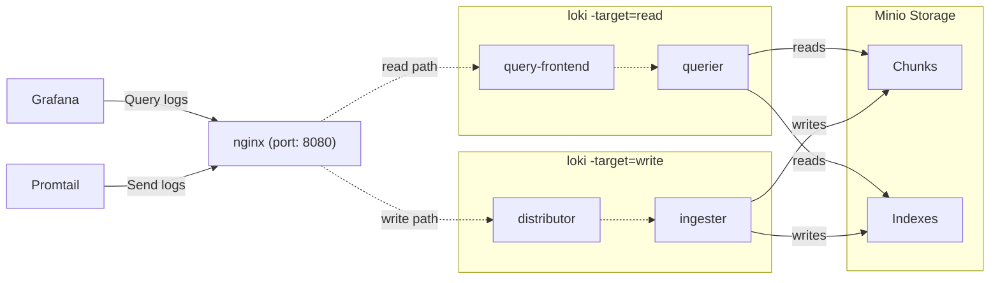

# Metrics stack docker-compose

You can use this `docker-compose` setup to run Docker for development purpose

## Features

- Prometheus for metric collection
- Grafana for visulization
- Loki for logs

## Diagram

The below diagram describes the various components of this deployment, and how data flows between them.

## Getting Started

Ajust `app_metrics` job to scrape the correct port of your app metric endpoint

Simply run `docker-compose up` and all the components will start.

It'll take a few seconds for all the components to start up and register in the [ring](http://localhost:8080/ring). Once all instances are `ACTIVE`, Loki will start accepting reads and writes. All logs will be stored with the tenant ID `docker`.

All loki data will be stored in the `.data` directory.

The nginx gateway runs on port `8080` and you can access Loki through it.

Prometheus runs on port `9090`, and you can access all metrics from Loki & Promtail here.

Grafana runs on port `3000`, and there are Loki & Prometheus datasources enabled by default.
