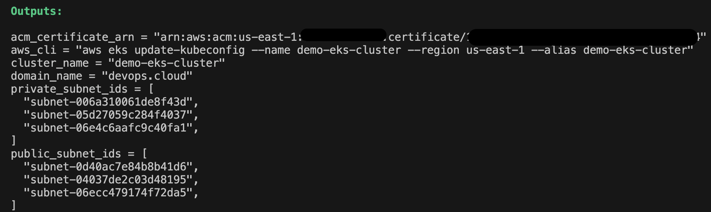
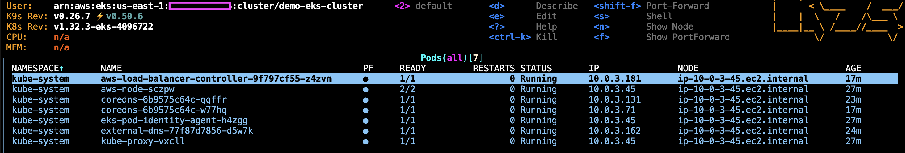
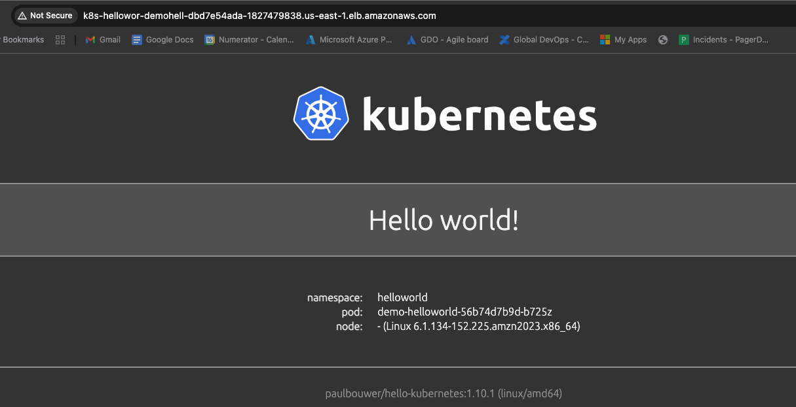

# Playground AWS

This folder contains Terraform-based modules for deploying and managing AWS infrastructure for demonstration purposes.

It showcases how to deploy a simple containerized application [paulbouwer/hello-kubernetes](https://hub.docker.com/r/paulbouwer/hello-kubernetes) on an Amazon EKS cluster. In addition, it provisions supporting infrastructure such as VPCs (with public and private subnets), the AWS Load Balancer Controller, ExternalDNS, and optional ACM certificates — all necessary for deploying real-world Kubernetes workloads.

## Design Overview

This setup is designed to demonstrate a modular AWS resources deployment using Terraform. The infrastructure follows best practices such as separating private and public subnets, enabling ALB and ExternalDNS integration, and supporting both internal and public access paths.

## Prerequisites

- AWS account with necessary permissions.
- Terraform installed locally.
- Kubernetes CLI.
- AWS CLI.

## Getting Started

The playground supports 2 deployment scenarios:

### Option 1 - Deploy to an existing EKS cluster

#### Prerequisites

- Existing **EKS cluster** and **VPC infrastructure**
- **AWS ALB Ingress Controller** or **NGINX Ingress Controller** already deployed (if using ingress)
- A valid ACM certificate should be available (for HTTPS)
- **ExternalDNS** add-on to dynamically control DNS records in AWS 
- **Security group** to allow inbound and outbound traffic between the ALB and EKS worker nodes. The deployment is equiped with one generic security group if neccessary

## Deployment Steps

1. Navigate to [deployment/helloworld](./deployment/helloworld/) where the application deployment files are located.
2. Configure [terraform.tfvars](./security-group/terraform.tfvars) in `security-group` (if security group is needed) and [terraform.tfvars](terraform.tfvars) in the current folder with your account VPC and cluster information.
3. If you're using an S3 backend, update `remote-backend.tf`.
4. Verify `provider.tf` contains your AWS provider configuration.
5. Create a generic security group to allow inbound and outbound traffic between the ALB and EKS worker nodes. ***Skip this step if you already have an existing security group for this purpose.***

| Security Group      | Inbound Traffic Source                            | Ports            | Outbound Traffic | Description                                      |
|---------------------|----------------------------------------------------|------------------|------------------|--------------------------------------------------|
| `private_alb_sg_id` | Internal CIDRs (VPC and/or VPN)                   | 80, 443          | Allow all        | For internal ALB access                         |
| `public_alb_sg_id`  | 0.0.0.0/0 (public internet)                       | 80, 443          | Allow all        | For public ALB access                           |
| `eks_node_sg`       | `private_alb_sg_id` or `public_alb_sg_id`         | All Ports | Allow all        | Attached to EKS nodes to accept ALB traffic     |

- Run the following commands

```
cd security-group/
terraform init
terraform plan
terraform apply
```

- Sample output:
```
Outputs:

eks_node_sg_id = "sg-XXXXXXXXXXX"
private_alb_sg_id = "sg-XXXXXXXXXXX"
public_alb_sg_id = "sg-XXXXXXXXXXX"
```

- Attach `eks_node_sg_id` to your EKS worker node security groups
- Depending on your ALB access preference, use either `private_alb_sg_id` or `public_alb_sg_id` in your ALB annotation 
```
alb.ingress.kubernetes.io/security-groups: sg-XXXXXXXXXXX
```

6. Deploy the application:

```
terraform init
terraform plan
terraform apply
```

For this demonstration, the application was deployed in a private subnet and is accessible on VPN


Service timed out if the access it not private


### Option 2 - Deploy the complete environment (EKS, VPC, ALB Controller, ExternalDNS)

## Deployment Steps

1. Navigate to [deployment/](./deployment/) folder. You should see 2 folders:
- **`all-in-one-eks/`**:  
  A comprehensive Terraform setup for provisioning an Amazon EKS cluster with associated VPC, subnets, ALB, DNS and externalDNS.
- **`helloworld/`**:  
  A Terraform deployment for a simple "Hello Kubernetes" application.

2. Navigate to [all-in-one-eks](./deployment/all-in-one-eks/) to deploy the infrastructure

- Update `remote_backend.tf` if using s3
- Update `provider.tf` to ensure your aws provider is correct
- Deploy:

```
terraform init
terraform plan
terraform apply
```
- Provisioning can take 15+ minutes. You should see outputs similar to the example below:



- You should then be able to access the cluster, which will be ready for the next step



***ACM validation can take more than 45 minutes to complete. For simplicity, this demo deploys the app over HTTP without ACM.***




## 🧹 Cleanup

When you're done playing in the cloud sandbox, don't forget to run:

`terraform destroy`

Think of it as telling AWS, "Thanks for the compute, but I'm not paying for idle greatness." 😄
This command will gracefully tear down all the resources you’ve provisioned — no orphaned ALBs left behind to haunt your billing dashboard.