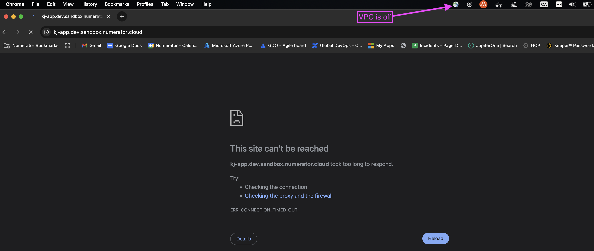

# Helloworld Deployment to EKS

This Terraform deployment provisions a simple "Hello Kubernetes" containerized service (`paulbouwer/hello-kubernetes`) to an existing EKS cluster.

## Features

- Deploys a sample web app using the image `paulbouwer/hello-kubernetes`
- Creates a dedicated **Namespace**, **Kubernetes Deployment**, **Service**, and optional **Ingress**
- Supports custom Ingress classes (`nginx`, `alb`, etc.)
- Configurable ingress **annotations** and **hostname**
- Generic ALB security groups to support public or internal access from VPC

## Prerequisites

- Terraform
- Existing **EKS cluster** and **VPC infrastructure**
- **Kubernetes provider** configured for the target cluster
- **AWS ALB Ingress Controller** or **NGINX Ingress Controller** already deployed (if using ingress)
- A valid ACM certificate should be available (for HTTPS)


## Example: How to Deploy

1. Configure [terraform.tfvars](./security-group/terraform.tfvars) in `security-group` and [terraform.tfvars](terraform.tfvars) in the current folder with your account VPC and cluster information.
2. If using remote backend `s3` ensure it's configured in `remote-backend.tf`. Otherwise, use local backend
3. Create a generic security group to allow inbound and outbound traffic between the ALB and EKS worker nodes.
Skip this step if you already have an existing security group for this purpose.

| Security Group      | Inbound Traffic Source                            | Ports            | Outbound Traffic | Description                                      |
|---------------------|----------------------------------------------------|------------------|------------------|--------------------------------------------------|
| `private_alb_sg_id` | Internal CIDRs (VPC and/or VPN)                   | 80, 443          | Allow all        | For internal ALB access                         |
| `public_alb_sg_id`  | 0.0.0.0/0 (public internet)                       | 80, 443          | Allow all        | For public ALB access                           |
| `eks_node_sg`       | `private_alb_sg_id` or `public_alb_sg_id`         | All Ports | Allow all        | Attached to EKS nodes to accept ALB traffic     |


- Navigate to [scripts](./scripts/) folder and execute
```
bash create_security_group.sh
```

- Or navigate to [security-group](./security-group/) and execute terraform commands
```
terraform init
terraform plan
terraform apply
```

The below outputs should return
```
Outputs:

eks_node_sg_id = "sg-XXXXXXXXXXX"
private_alb_sg_id = "sg-XXXXXXXXXXX"
public_alb_sg_id = "sg-XXXXXXXXXXX"
```

- Attach `eks_node_sg_id` to your EKS worker node security groups
- Depends on whether you ALB to be internal or publicly accessible, assign either `private_alb_sg_id` or `public_alb_sg_id` to your ALB annotation `alb.ingress.kubernetes.io/security-groups` accordingly

2. Run the standard Terraform workflow to create the application:

- Navigate to [scripts](./scripts/) folder and execute:

```
bash deploy_app.sh
```

- Or in the same folder, execute:
```
terraform init
terraform plan
terraform apply
```

Below is an example of a working service with internal access on VPN


Service timed out if the access it not private


