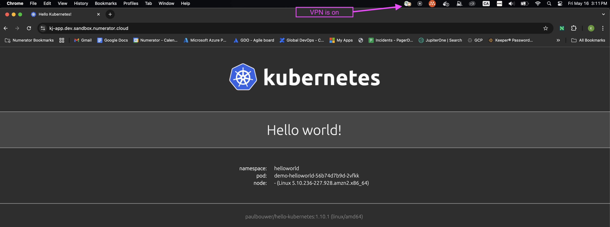

# Helloworld Kubernetes Module for AWS EKS

This module deploys a simple "Hello Kubernetes" web app into an AWS EKS cluster. It includes:

- A dedicated Kubernetes `Namespace`
- A `Deployment` for the containerized app (`paulbouwer/hello-kubernetes`)
- A `Service` (ClusterIP)
- An optional `Ingress`, supporting annotations and class configuration (e.g., ALB)


## Example Usage

```
module "helloworld" {
  source         = "../modules/helloworld"
  enable_ingress = true
  ingress_hostname   = "kj-app.${local.subdomain}.${local.domain_name}"
  ingress_annotations = {
    "alb.ingress.kubernetes.io/certificate-arn" = data.aws_acm_certificate.this.arn
    "alb.ingress.kubernetes.io/security-groups" = data.terraform_remote_state.global_security_groups.outputs.generic_private_alb
    "alb.ingress.kubernetes.io/subnets"         = join(",", data.terraform_remote_state.vpc.outputs.prd_private_subnets)
    "alb.ingress.kubernetes.io/scheme"          = "internal"
  }
}

```

Below is a screenshot of the running app if the deployment is successful


